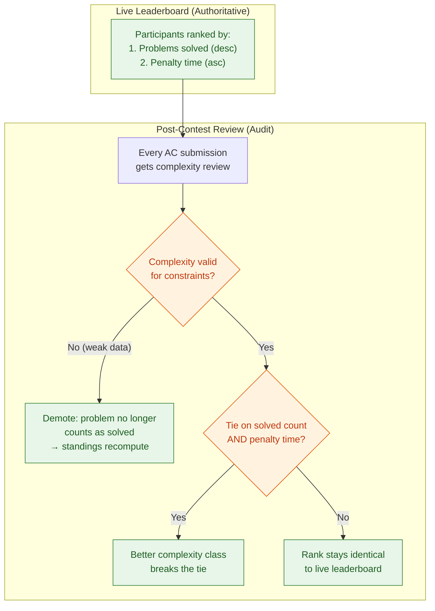

# BYTEARENA — Architecture

This document is the technical companion to `README.md`. It covers deployment topology, data model, the judge worker's sandboxing design, scoring rules, the realtime/API layer, auth, anti-cheat implementation, and the build sequence — everything needed to go from plan to implementation.

---

## 1. Deployment Model

Single organizer laptop runs every BYTEARENA service. Participant code never runs anywhere except inside the judge worker's sandbox on that same laptop.

- **Process manager:** `docker-compose` (or a plain `systemd`/`supervisord` setup) to run BYTEARENA's *own* services — contest server, judge worker(s), queue. This is separate from, and unrelated to, the sandboxing used for *participant* code.
- **Web server:** FastAPI behind Uvicorn (or Gunicorn+Uvicorn workers for the contest server, since it needs to handle many concurrent WebSocket connections).
- **Queue:** for the MVP, a DB-backed queue table (`submissions` with a `status` column, polled or notified via SQLite's nothing-fancy approach) avoids adding Redis as a dependency to a single-laptop deploy. If judge worker count grows past a handful, or once you're on Postgres in production, swap to Redis/RQ or Postgres `LISTEN/NOTIFY` — the worker interface doesn't need to change, just the queue backend.
- **Database:** SQLite with `PRAGMA journal_mode=WAL` for MVP (allows concurrent reads — e.g. leaderboard polling — while writes happen). PostgreSQL for larger deployments or if running across more than one machine.
- **Static assets:** frontend build (React) and editor (Monaco) are vendored into the served bundle — nothing fetched from a CDN at runtime, since the whole point of the platform is that it works with zero internet.

## 2. Database Schema

```
contests
  id, name, start_at, end_at, state, freeze_minutes, penalty_minutes

problems
  id, contest_id, code, title, statement_md, time_limit_ms, mem_limit_mb, points

testcases
  id, problem_id, input_path, output_path, is_sample, points, checker_type

participants
  id, contest_id, username, password_hash, team_name, seat_id

submissions
  id, participant_id, problem_id, lang, source_path, submitted_at,
  status,        -- queued | compiling | running | judged | compile_error | judge_error
  verdict,       -- AC | WA | TLE | MLE | RE | CE | PENDING
  runtime_ms, mem_kb

verdicts               -- per-testcase result, one row per (submission, testcase)
  id, submission_id, testcase_id, status, runtime_ms, mem_kb

events                 -- unified anti-cheat / connection timeline
  id, participant_id, type,   -- heartbeat | tab_switch | window_blur | fullscreen_exit | internet_detected
  payload, ts

warnings
  id, participant_id, reason, ts, resolved_by, resolved_at

review_flags            -- manual review outcomes
  id, submission_id, reviewer, decision,  -- approved | rejected | flagged
  note, ts

complexity_reviews      -- AI-suggested, judge-confirmed complexity per submission
  id, submission_id, ai_suggested_class, ai_reasoning,
  judge_decision, judge_class, judge_note, reviewer, ts

plagiarism_matches      -- Phase 3
  id, submission_a_id, submission_b_id, similarity_score, ts
```

Design notes:
- `submissions.source_path` points to a file under `Contest/Submissions/<participant>/`, matching the existing project layout — keeps source out of the DB, which makes manual review (open the file directly) and the post-contest batch analysis (walk the filesystem) simpler.
- `status` and `verdict` are separate columns: `status` tracks pipeline stage, `verdict` tracks the judging outcome. This avoids overloading one enum for two different concerns.
- Every anti-cheat signal (heartbeat, tab switches, fullscreen exits, internet probes) writes to the same `events` table so the organizer dashboard can render one unified per-participant timeline instead of three separate widgets.

## 3. Judge Worker & Sandboxing

This is the piece to build correctly from the MVP — the judge worker executes untrusted, participant-submitted code from day one, well before Phase 3's "Docker sandboxing" line item.

**Design the worker around a stable interface so the sandbox backend can be swapped without touching the rest of the system:**

```
compile(source_path, lang) -> CompiledArtifact | CompileError
run(artifact, input, limits) -> RunResult(stdout, stderr, runtime_ms, mem_kb, exit_status)
```

**MVP backend (OS-level isolation):**
- Dedicated low-privilege OS user with no write access outside a per-run scratch directory, wiped after every run.
- CPU and memory caps via Python's `resource.setrlimit` (`RLIMIT_CPU`, `RLIMIT_AS`).
- Hard wall-clock timeout via `subprocess.run(..., timeout=...)`, killing the process group on expiry (not just the parent) to catch fork bombs.
- No network namespace access — block outbound sockets at the OS level (e.g. a restrictive `iptables`/firewall rule scoped to that user, or run under a network namespace with only loopback).
- Language config table (compile command, run command, extension) keyed by language name — start with C, C++, Python, Java, and add languages by adding config entries rather than new code paths:

```python
LANGUAGES = {
    "cpp":    {"compile": "g++ -O2 -o {out} {src}", "run": "{out}"},
    "c":      {"compile": "gcc -O2 -o {out} {src}", "run": "{out}"},
    "python": {"compile": None,                      "run": "python3 {src}"},
    "java":   {"compile": "javac {src}",              "run": "java -cp {dir} {class}"},
}
```

**Phase 3 backend (container-level isolation):** swap the same `compile`/`run` interface to shell out to Docker (or a lighter runtime like gVisor/nsjail if container startup latency matters at scale) with equivalent resource limits enforced by the runtime instead of `rlimit`. Because callers only see `compile()`/`run()`, this is a backend swap, not an architectural change.

**Queue & scaling:** judge workers pull jobs from the shared queue independently — scaling from 1 to N workers is just running more worker processes, no coordination logic needed beyond the queue itself (`SELECT ... FOR UPDATE SKIP LOCKED`-style claim, or a proper queue library once on Redis).

**Verdict states:** `AC`, `WA`, `TLE`, `MLE`, `RE` (runtime error/non-zero exit), `CE` (compile error), plus an internal `JUDGE_ERROR` for infra failures (distinct from `RE` — a judge bug shouldn't look like the participant's fault).

## 4. Scoring Engine

**Live phase (during the contest):**
- Binary per-problem status: solved / not solved, based on first `AC`.
- Ranking: (problems solved, descending) → (total penalty time, ascending).
- Penalty time per solved problem = minutes from contest start to first `AC` + `penalty_minutes` (default 20) × number of prior wrong submissions on that problem. This is the standard ICPC-style rule — building it into the scoring engine now means the "ICPC penalties" roadmap item is already done by the time Phase 3 arrives; what's left then is just surfacing it in the UI/reports.
- **Freeze window:** for the last `freeze_minutes` (contest-configurable, e.g. 30–60 min), participant-facing leaderboard stops updating even though judging continues live. Organizer dashboard always shows real-time standings. Unfreeze at contest end reveals the final live order before manual review adjustments.

**Post-contest batch phase (single pass over every accepted submission) — judge-driven, AI-assisted:**

This is a human-in-the-loop step, not a fully automated one. The judges (organizer + co-organizers) make the actual call; AI speeds up their read of each submission rather than replacing it.

- **AI-assisted complexity suggestion** — for every accepted submission, an LLM is given the source code and the problem's constraints (input size bounds from `config.json`) and asked to return a suggested complexity class (e.g. O(n log n)) with a short justification. This is a *suggestion*, stored alongside the submission, not a final score.
- **Judge review** — a review screen shows, per submission: the source code, the AI's suggested complexity + reasoning, and accept / override / flag controls. The judge either confirms the AI's read or overrides it with their own — overrides are logged (`judge_note`) so there's a record of why a submission's complexity call differs from the AI's.
- **Plagiarism detection** (Phase 3) — token-based AST similarity, run over the same set of accepted submissions in the same batch pass, since they're already being opened for complexity review. Flags surface on the same review screen rather than a separate pass.
- **Final leaderboard — gate/tiebreaker model:** the live standings (solved count, then penalty time) remain the primary rank. The judge-confirmed complexity review does **not** continuously reweight scores — it only acts in two specific cases:



1. **Invalid solution found** — the judge marks a submission's complexity as clearly wrong for the problem's stated constraints (i.e. it only passed because the test data was weak). That submission is demoted — the problem no longer counts as solved for that participant, and standings recompute from there.
2. **Tie on solved count and penalty time** — among participants tied on both, the one with the better judge-confirmed complexity class ranks higher. Efficiency is a tiebreaker, never a reason to move someone ahead of a participant who is strictly ahead on solved count or penalty time.

This keeps the leaderboard participants watched live authoritative — the post-contest pass is an audit for validity and a tiebreaker, not a wholesale re-ranking. No points-weighting formula between speed and efficiency is needed, which avoids an inherently arguable "how many penalty-minutes is one complexity class worth" number.

**Schema addition:**
```
complexity_reviews
  id, submission_id,
  ai_suggested_class,   -- e.g. "O(n log n)"
  ai_reasoning,          -- short model-generated justification
  judge_decision,        -- valid | invalid
  judge_class,           -- final complexity class, used only for tiebreaking
  judge_note,
  reviewer, ts
```

**The internet tradeoff this introduces:** BYTEARENA's core promise is zero internet access, but a cloud LLM API needs a connection. Two ways to resolve it:
- **Stay fully offline (recommended default):** run a local model via Ollama or similar on the organizer laptop for the complexity pass. Post-contest analysis happens after the contest ends, so it doesn't need to be fast or during the live window — a small local model doing one pass over maybe 50–200 accepted submissions is a reasonable batch job.
- **Reconnect briefly, post-contest:** since the complexity pass happens *after* judging closes and all submissions are already in, the organizer laptop could reconnect to the internet at that point only, call a cloud API, then go back offline. This is simpler to build but is worth stating explicitly to organizers rather than silently breaking the "no internet, ever" claim — even if it only touches the network after the contest is over.

Either way, the review screen and schema above stay identical — only the AI call's backend changes, same pattern as the sandbox swap in §3.

## 5. API & Realtime Design

- **REST** for CRUD: contests, problems, testcases, participants, submissions (create/list/detail), review actions.
- **WebSocket**, one channel per contest, carrying:
  - Leaderboard deltas (not full re-sends — send only what changed, since a 100+ participant contest re-broadcasting the full table on every verdict will saturate a modest Wi-Fi LAN).
  - Verdict-ready push to the submitting participant.
  - Organizer dashboard stream: queue depth, worker health, connection/event timeline, warnings.
- **Rate limiting** on submission intake (e.g. token bucket per participant) to stop submission-spam from overwhelming the judge queue, whether malicious or just anxious clicking.
- **Contest state machine:** `scheduled → running → (paused) → frozen → ended`. State transitions are organizer-triggered, logged, and broadcast over the dashboard channel. Pause stops the timer and freezes submission acceptance; extend pushes `end_at` forward.

## 6. Auth & Participant Flow

- **Pre-provisioned accounts** — organizer uploads a participant list (CSV or via dashboard) before the contest starts. This fits the offline model much better than self-registration, since there's no email/SMS verification path available on an isolated LAN anyway.
- **Session tokens** scoped to a single contest, short-lived, tied to heartbeat state. If heartbeats stop, mark the participant `disconnected` in the dashboard but do **not** invalidate the session — on reconnect (Wi-Fi drop, laptop sleep) they resume exactly where they left off, no re-login, no lost timer position.
- **Reconnect flow:** client caches submission-in-flight state locally; on reconnect it re-syncs against the server's authoritative submission/verdict state rather than assuming its last-known state is current.

## 7. Anti-Cheat Implementation

| Layer | Implementation detail |
|---|---|
| LAN isolation | Structural — no code change needed beyond ensuring the contest server never listens on a WAN-facing interface. |
| Heartbeat | Client `POST /heartbeat` every 5–10s; server marks `disconnected` after ~20s silence. Logged to `events`. |
| Browser events | `visibilitychange`, `blur`/`focus`, `fullscreenchange` listeners. **Batch client-side and flush every few seconds** — firing one HTTP request per event is chatty at 100+ concurrent participants on shared Wi-Fi. |
| Internet detection | Background `fetch` (short timeout) to a public endpoint every 30–60s; failure is the expected/good state, success triggers a dashboard + participant-facing warning. |

All four feed the same `events` table, giving the organizer dashboard one unified per-participant timeline instead of separate widgets per signal.

**Stated limitation (for organizer-facing docs, not just internal notes):** none of these layers can see a second device — a phone on mobile data outside the browser tab is invisible to all four. This is a structural limit of any LAN-based system, not a BYTEARENA-specific gap, and should be communicated plainly rather than implied to be solved.

## 8. Resilience

- SQLite in WAL mode so leaderboard reads don't block submission writes.
- Contest state (timer, standings, submission queue) is fully DB-derived, not held only in server memory — if the contest server process restarts mid-contest, it can reconstruct current state from the DB rather than losing the contest.
- Participant reconnect flow (above) handles client-side drops without penalizing the participant.
- Periodic DB backup/export during a live contest (e.g. every N minutes, copy the SQLite file or `pg_dump`) as a cheap insurance policy against laptop failure — full recovery tooling can come later, but the backup habit should exist from the MVP.

## 9. Build Sequence

Resequenced from the original phase list to move safety- and day-of-experience-critical items earlier:

1. **MVP** — contest CRUD, LAN hosting, login, problem viewing/submission, **OS-level sandboxed** judging (§3 MVP backend), live leaderboard with ICPC-style penalty scoring already built in, manual review, mDNS auto-discovery, submission rate limiting.
2. **Phase 2 — Enhancement** — captive portal, practice mode, clarifications, contest templates, leaderboard freeze window.
3. **Phase 3 — Advanced** — swap sandbox backend to Docker/gVisor (interface unchanged, §3), plagiarism detection bundled into the existing post-contest batch job (§4), contest import/export, analytics dashboard.

The key structural decision that makes this sequence work: the judge worker's `compile()`/`run()` interface and the scoring engine's penalty/freeze logic are both designed once, correctly, in the MVP — later phases upgrade backends and add analysis passes without rearchitecting either.
