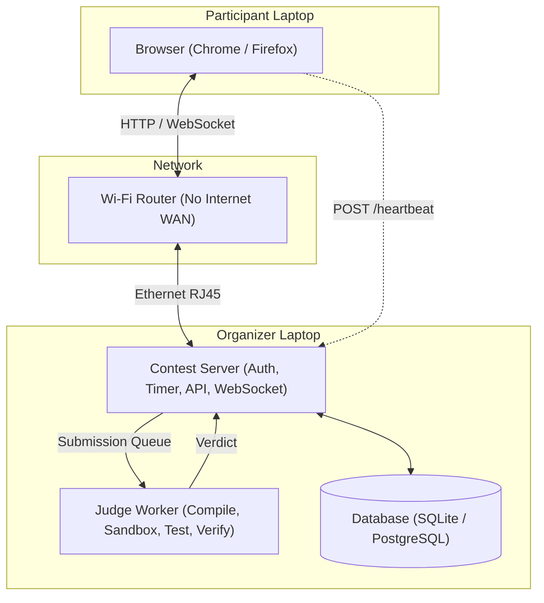
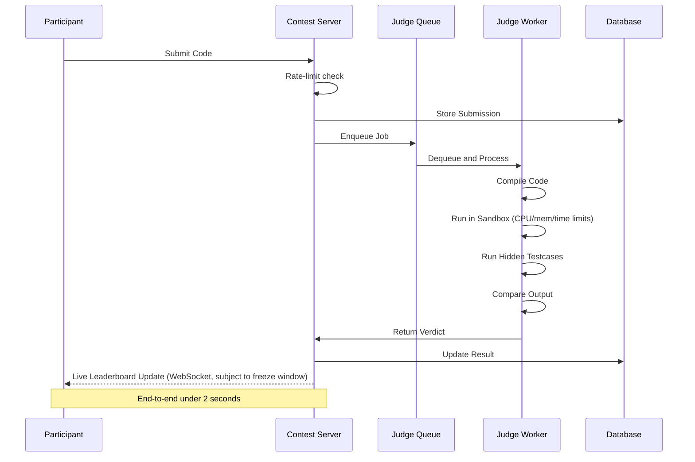
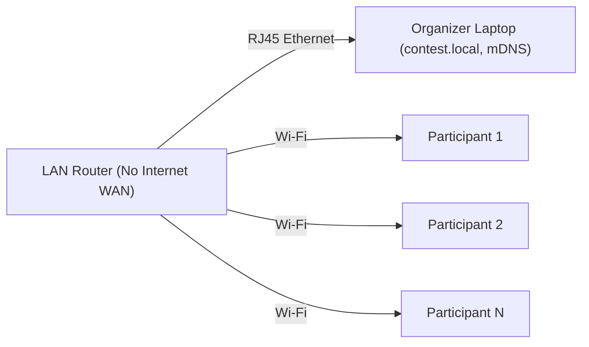
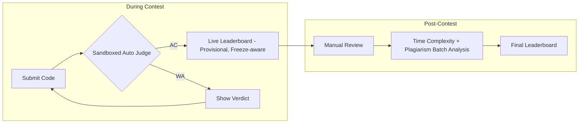
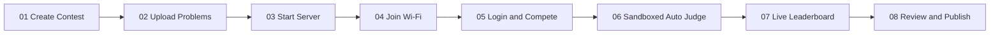
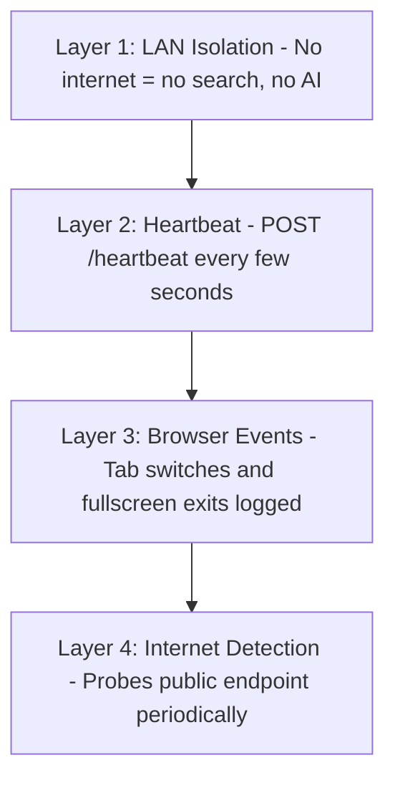
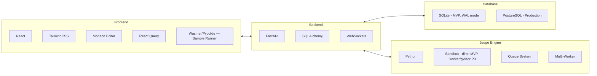
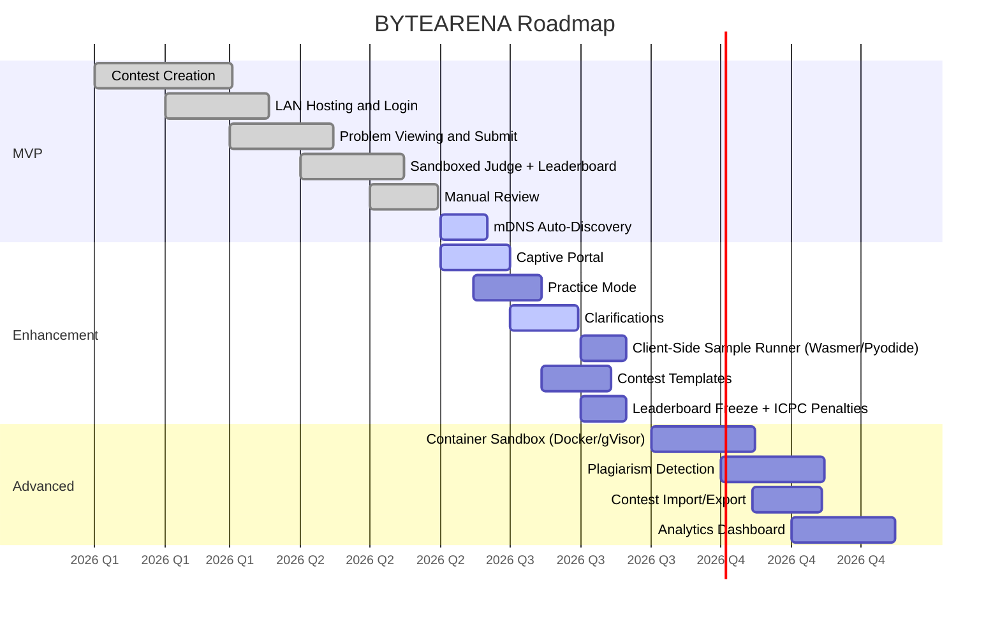

# BYTEARENA — by BYTEMONK

**Offline LAN Contest Platform**

A portable, offline-first competitive programming platform that lets colleges, schools, coding clubs, and hackathons run secure programming contests using nothing more than a laptop and a Wi-Fi router. No cloud. No internet. Just code.

---

## Why LAN Instead of Cloud?

| ❌ Cloud Problems | ✅ BYTEARENA Solution |
|---|---|
| Participants can search Google | Contest exists only on LAN |
| Participants can use ChatGPT | Disconnect Wi-Fi → contest disappears |
| Internet reliability is a dependency | Zero hosting infrastructure |
| Hosting costs keep adding up | Completely free to run |

> **Note:** the "no internet" promise extends to the tooling too — no CDN-loaded fonts, CSS frameworks, or editor bundles anywhere in the stack (landing page included). Everything ships vendored.

## Architecture



### Components

- **Contest Server** — Authentication, contest state machine, timer, problem distribution, submission intake, rate limiting, leaderboard generation (with freeze window), organizer dashboard, and WebSocket push for live updates.
- **Judge Worker** — An independent, queue-driven service that picks submissions, compiles code, executes it under resource limits (sandboxed), runs hidden testcases, compares output, and returns a verdict. Scales to multiple workers. See [ARCHITECTURE.md](./ARCHITECTURE.md) for the sandboxing design.
- **Database** — SQLite (WAL mode) for MVP/single-laptop deployment; PostgreSQL for larger or multi-machine production deployments.

## Submission Pipeline



## Network Topology



Organizer on Ethernet (RJ45) · Participants on Wi-Fi · No internet access. `contest.local` is advertised via mDNS so participants don't need to know the server's IP.

## Features

- **Scoring System** — Every submission timestamped. Leaderboard ranks by problems solved, then ICPC-style penalty time (minutes-to-AC + fixed penalty per wrong attempt).
- **Live Leaderboard** — WebSocket-driven real-time updates, with a configurable freeze window near the end of the contest (standings hidden from participants, visible to the organizer).
- **Manual Review** — Organizer can review every submission — source code, execution stats, timeline — then approve, reject, or flag.
- **Organizer Dashboard** — Live view of timer, participants, submissions, judge queue, server health, and warnings.
- **Connection Monitoring** — Heartbeat system and browser event logging. Know who disconnects, switches tabs, or exits fullscreen.
- **Anti-Cheating** — Four layers: LAN isolation, heartbeat, browser event logging, and internet detection.
- **Sandboxed Execution** — All submissions run under CPU, memory, and wall-clock limits, isolated from the host filesystem and network — from the MVP onward (see [Security](#security)).
- **Client-Side Sample Runner** — C/C++ and Python run in-browser (Wasmer/Pyodide) against the sample testcases for instant pass/fail feedback before submitting; the official verdict still comes only from the server-side judge.

## Two-Phase Evaluation



1. **Live Leaderboard (Provisional)** — During the contest, every accepted submission updates a live leaderboard via WebSockets using correctness and ICPC-style penalty time. Freezes for the last N minutes to preserve suspense and prevent standings-sniping.
2. **Post-Contest Analysis (Ultimate)** — After the contest, judges review every accepted solution's time complexity with AI assistance: an LLM suggests a complexity class and reasoning per submission, and a judge confirms it. The live standings (solved count, then penalty time) stay the primary rank — the review only demotes a submission if its complexity is clearly wrong for the problem's constraints (passed on weak test data), and only breaks ties when two participants are otherwise equal. It never reshuffles the leaderboard beyond that. Plagiarism detection (token/AST similarity) surfaces on the same review pass in Phase 3.

## Contest Lifecycle



Contest state machine: `scheduled → running → (paused) → frozen → ended`. Organizer can pause/extend at any point; state changes are logged and broadcast over the dashboard WebSocket.

## Anti-Cheating Strategy



| Layer | Method | Detection |
|---|---|---|
| 1 | LAN Isolation — Contest exists only inside local network | Disconnect → contest disappears |
| 2 | Heartbeat — Browser sends `POST /heartbeat` every 5–10s | Organizer sees disconnects within ~20s |
| 3 | Browser Events — Tab switches, window blurs, fullscreen exits | Batched client-side, logged live on dashboard with timestamps |
| 4 | Internet Detection — Browser periodically probes a public endpoint | Warning flagged on dashboard and participant screen |

**Known limitation:** none of these layers can detect a second device (e.g. a phone on mobile data) used outside the browser tab. This is an inherent limit of any LAN-based system, not a gap specific to BYTEARENA — worth stating plainly to organizers rather than overselling coverage.

## Security

Sandboxing is a **day-one requirement, not a Phase 3 nice-to-have** — the judge worker executes untrusted participant code starting with the MVP, so isolation has to exist from the first release:

- **MVP:** OS-level isolation — dedicated low-privilege user, `rlimit`-enforced CPU/memory caps, hard wall-clock timeouts, no network namespace access, wiped scratch directory per run.
- **Phase 3:** upgrade to container-level isolation (Docker or a lighter runtime like gVisor/nsjail) behind the same compile/run interface, so the swap doesn't require a worker rewrite.

Separately: the post-contest AI-assisted complexity review (see [Two-Phase Evaluation](#two-phase-evaluation)) is the one point in the system that wants a network call. Default is a **local model** on the organizer laptop so the "no internet, ever" promise holds end to end; a cloud API is a simpler-to-build alternative if the team is fine reconnecting briefly after judging closes.

Full detail in [ARCHITECTURE.md](./ARCHITECTURE.md#judge-worker--sandboxing).

## Tech Stack



| Area | Technologies |
|---|---|
| Backend | FastAPI, SQLAlchemy, SQLite (WAL, MVP), PostgreSQL, WebSockets |
| Frontend | React, TailwindCSS, Monaco Editor, React Query, Wasmer/Pyodide sample runner — all dependencies vendored, no CDN |
| Judge & Networking | Python, rlimit sandbox (MVP) → Docker/gVisor (P3), Queue System, Multi-Worker, mDNS |

## Project Layout

```
Contest/
├── Problems/
│   ├── A/
│   │   ├── statement.md
│   │   ├── tests/
│   │   └── config.json
│   ├── B/
│   └── C/
├── Submissions/
│   ├── Alice/
│   └── Bob/
├── Database/
├── Logs/
└── Config/
```

## Development Roadmap



> See [ROADMAP.md](./ROADMAP.md) for the linear sprint-by-sprint build order with concrete definitions of done.

### Phase 1 — MVP (Core Platform)
Contest creation, LAN hosting, login, problem viewing, code submission, **sandboxed** automatic judging, leaderboard, manual review, and mDNS auto-discovery (pulled forward from Enhancement — high day-of impact, low effort).

### Phase 2 — Enhancement (Quality of Life)
Captive portal, practice mode, clarification requests, contest templates, leaderboard freeze window, and ICPC-style penalty scoring.

### Phase 3 — Advanced (Production Ready)
Container-level sandboxing (Docker/gVisor) replacing the MVP's OS-level sandbox, multi-worker judge pool, plagiarism detection (bundled into the existing post-contest batch pass), contest import/export, and analytics dashboard.

## MVP Deliverables

- **Organizer**: Create Contest, Upload Problems, Start/Pause/Extend Contest, Review Submissions, Publish Results
- **Participant**: Join LAN, Login, Read Problems, Submit Code, View Verdict, View Leaderboard
- **System**: Offline Hosting, Sandboxed Testcase Verification, Timestamp Tracking, Live Leaderboard, Manual Review, mDNS Discovery, Submission Rate Limiting

## Getting Started

> The project is in the planning/design phase. See [ARCHITECTURE.md](./ARCHITECTURE.md) for the full technical design and [ROADMAP.md](./ROADMAP.md) for the sprint-by-sprint build plan.

---

<p align="center">No Cloud. No Internet. Just Code.</p>
