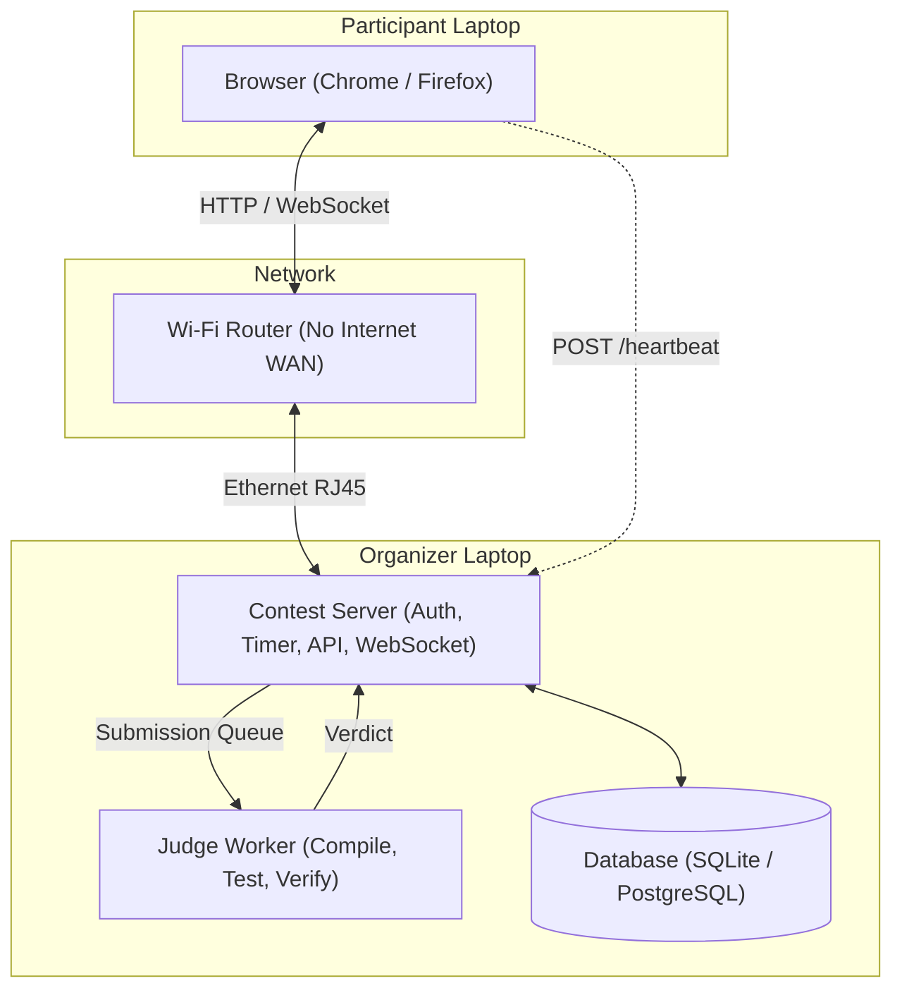
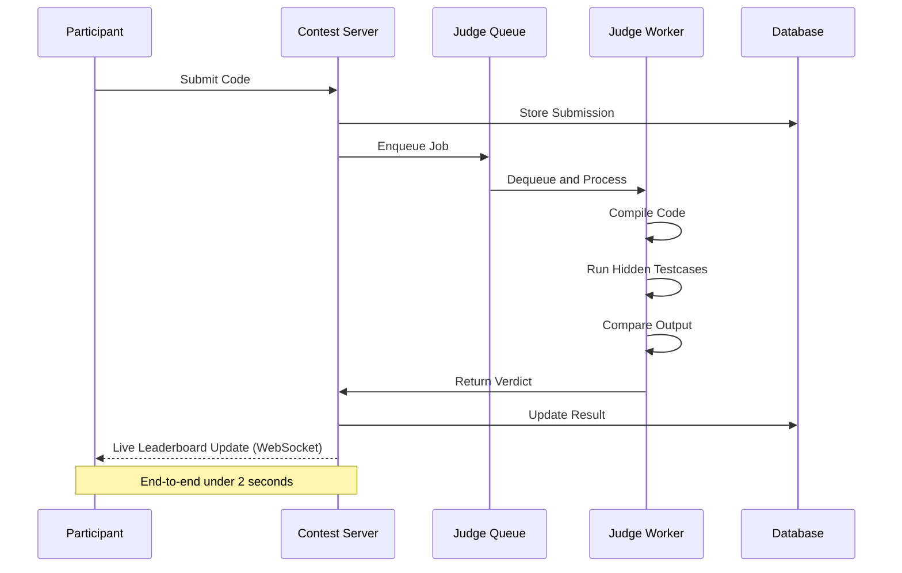
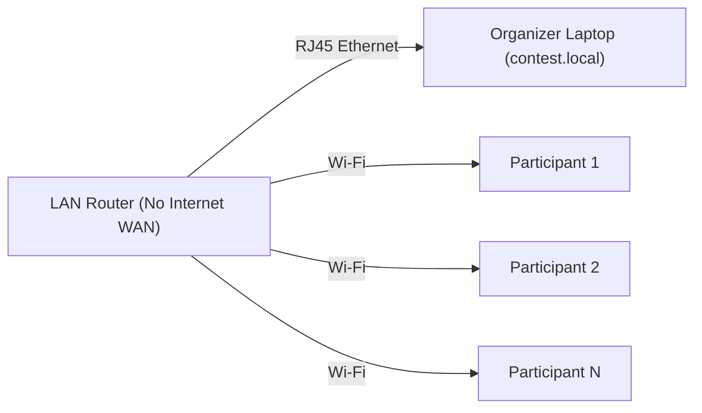
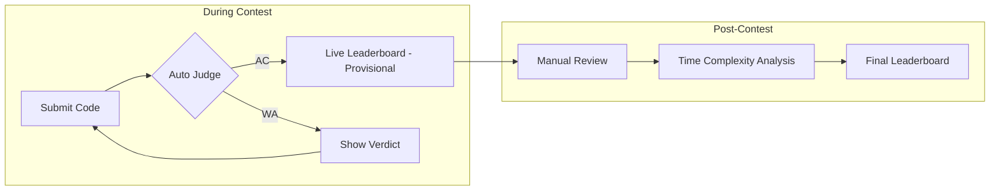
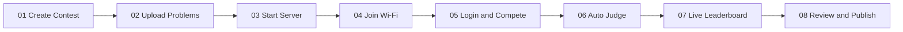
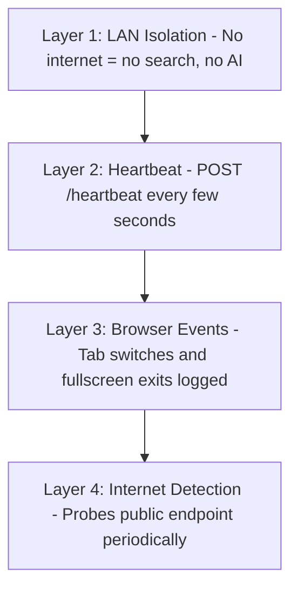
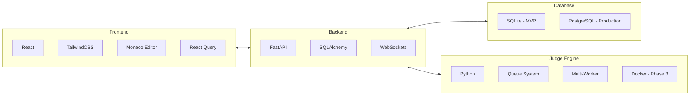
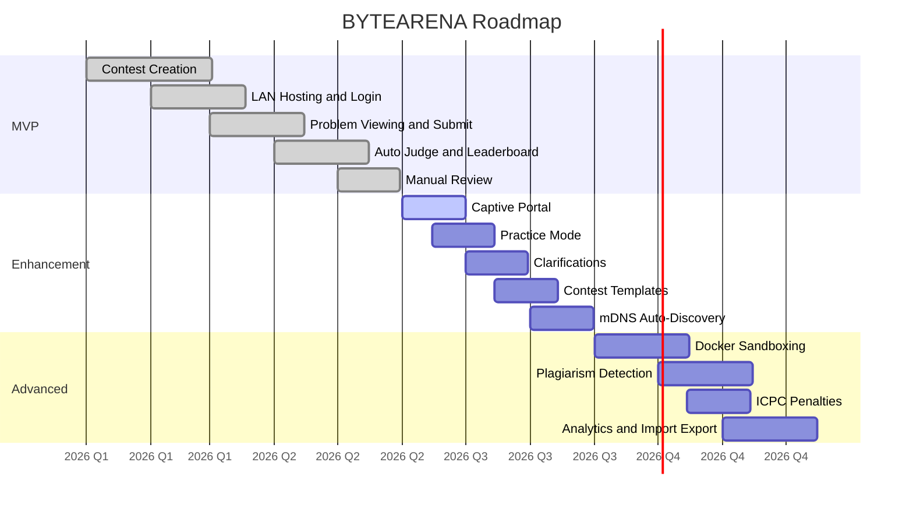

# BYTEARENA — by BYTEMONK

**Offline LAN Contest Platform**

A portable, offline-first competitive programming platform that lets colleges, schools, coding clubs, and hackathons run secure programming contests using nothing more than a laptop and a Wi-Fi router. No cloud. No internet. Just code.

---

## Why LAN Instead of Cloud?

| ❌ Cloud Problems | ✅ BYTEARENA Solution |
|---|---|
| Participants can search Google | Contest exists only on LAN |
| Participants can use ChatGPT | Disconnect Wi-Fi → contest disappears |
| Internet reliability is a dependency | Zero hosting infrastructure |
| Hosting costs keep adding up | Completely free to run |

## Architecture



### Components

- **Contest Server** — Handles authentication, contest timer, problem distribution, submission intake, leaderboard generation, organizer dashboard, and WebSocket push for live updates.
- **Judge Worker** — An independent service that picks submissions from a queue, compiles code, runs hidden testcases, compares output, and returns a verdict. Scales to multiple workers.
- **Database** — SQLite for MVP development; PostgreSQL for production deployments.

## Submission Pipeline



## Network Topology



Organizer on Ethernet (RJ45) · Participants on Wi-Fi · No internet access.

## Features

- **Scoring System** — Every submission timestamped. Leaderboard ranks by problems solved and first-accepted time.
- **Live Leaderboard** — WebSocket-driven real-time updates. Rank changes appear instantly.
- **Manual Review** — Organizer can review every submission — source code, execution stats, timeline — then approve, reject, or flag.
- **Organizer Dashboard** — Live view of timer, participants, submissions, judge queue, server health, and warnings.
- **Connection Monitoring** — Heartbeat system and browser event logging. Know who disconnects, switches tabs, or exits fullscreen.
- **Anti-Cheating** — Four layers: LAN isolation, heartbeat, browser event logging, and internet detection.

## Two-Phase Evaluation



1. **Live Leaderboard (Provisional)** — During the contest, every accepted submission updates a live leaderboard via WebSockets using correctness and time-to-solve.
2. **Post-Contest Analysis (Ultimate)** — After the contest, the system analyzes every accepted solution's time complexity in a single batch. The final leaderboard factors in solve time, time complexity, and manual review.

## Contest Lifecycle



## Anti-Cheating Strategy



| Layer | Method | Detection |
|---|---|---|
| 1 | LAN Isolation — Contest exists only inside local network | Disconnect → contest disappears |
| 2 | Heartbeat — Browser sends `POST /heartbeat` every few seconds | Organizer sees disconnects instantly |
| 3 | Browser Events — Tab switches, window blurs, fullscreen exits | Logged live on dashboard with timestamps |
| 4 | Internet Detection — Browser probes public endpoint periodically | Warning flagged on dashboard and participant screen |

## Tech Stack



| Area | Technologies |
|---|---|
| Backend | FastAPI, SQLAlchemy, SQLite (MVP), PostgreSQL, WebSockets |
| Frontend | React, TailwindCSS, Monaco Editor, React Query |
| Judge & Networking | Python, Queue System, Multi-Worker, Docker (Phase 3), mDNS |

## Project Layout

```
Contest/
├── Problems/
│   ├── A/
│   │   ├── statement.md
│   │   ├── tests/
│   │   └── config.json
│   ├── B/
│   └── C/
├── Submissions/
│   ├── Alice/
│   └── Bob/
├── Database/
├── Logs/
└── Config/
```

## Development Roadmap



### Phase 1 — MVP (Core Platform)
Contest creation, LAN hosting, login, problem viewing, code submission, automatic judging, leaderboard, and manual review.

### Phase 2 — Enhancement (Quality of Life)
Captive portal, practice mode, clarification requests, contest templates, and mDNS auto-discovery.

### Phase 3 — Advanced (Production Ready)
Docker sandboxing, multi-worker judge pool, plagiarism detection, ICPC penalties, contest import/export, and analytics dashboard.

## MVP Deliverables

- **Organizer**: Create Contest, Upload Problems, Start Contest, Review Submissions, Publish Results
- **Participant**: Join LAN, Login, Read Problems, Submit Code, View Verdict, View Leaderboard
- **System**: Offline Hosting, Auto Testcase Verification, Timestamp Tracking, Live Leaderboard, Manual Review

## Getting Started

> Coming soon — the project is currently in the planning/design phase.

---

<p align="center">No Cloud. No Internet. Just Code.</p>
